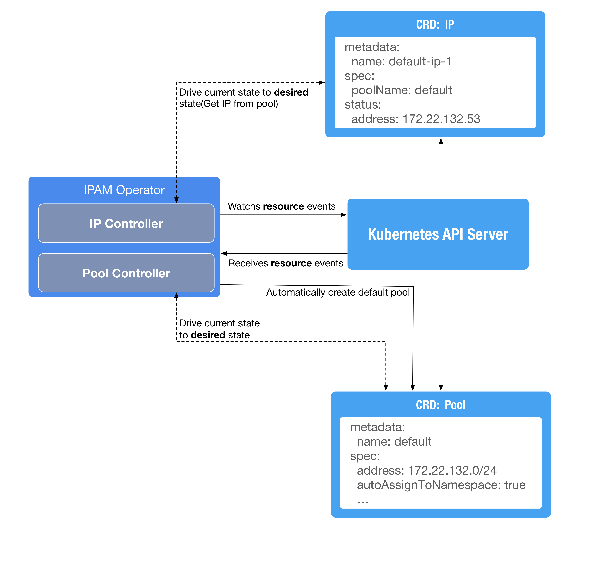

[](https://travis-ci.org/inwinstack/ipam-operator) [](https://hub.docker.com/r/inwinstack/ipam-operator/) [](https://codecov.io/gh/inwinstack/ipam-operator) 
# IPAM Operator
An operator to assign IP for Kubernetes Namespace. This operator will provide two custom resource(Pool and IP).



## Building from Source
Clone repo into your go path under `$GOPATH/src`:
```sh
$ git clone https://github.com/inwinstack/ipam-operator.git $GOPATH/src/github.com/inwinstack/ipam-operator
$ cd $GOPATH/src/github.com/inwinstack/ipam-operator
$ make dep
$ make
```

## Debug out of the cluster
Run the following command to debug:
```sh
$ go run cmd/main.go \
    --kubeconfig $HOME/.kube/config \
    --default-ignore-namespaces=kube-system,default,kube-public \
    --default-address=192.168.100.0/24 \
    --logtostderr -v=2
```

## Deploy in the cluster
Run the following command to deploy operator:
```sh
$ kubectl apply -f deploy/
$ kubectl -n kube-system get po
```
